summary: cohort_analysis
id: cohort_analysis
categories: snowflake
status: Published
feedback link: https://github.com/sigmacomputing/sigmaquickstarts/issues
tags: Getting Started, Analytics, Data Engineering, BI, Business Intelligence, Sigma, Sigma Computing, Snowflake, Dashboarding, Visualization, Analysis, Excel, Spreadsheet
authors: Kelsey Hammock, Sigma Computing

# Cohort Analysis
<!-- ------------------------ -->
## Overview 
Duration: 5

 This lab focuses on the end-user analytics experience in Sigma. You will be playing the role of a marketing analyst undertaking exploratory analysis on customer retention rates. Traditionally, this type of analysis requires a significant effort and advanced SQL knowledge, but Sigma empowers business users to quickly derive these insights on their own.

This lab is intended to showcase advanced features such as cross-level aggregate calculations, extracting values from JSON, Tracing lineage in Sigma, and showing different paths an analyst can take to achieve their goals. 

### Prerequisites
- This lab is designed to be a follow up to the Retention Analysis lab. If you have not already, please complete the steps for Retention Analysis here:

### What You Will Learn 
- How to create child elements from existing workbook objects 
- How to run calculations across multiple aggregation levels 
- How to apply custom formatting to objects in a Sigma workbook
- How to create visualizations in Sigma 
- How to build pivot tables for advanced analysis  
- How to leverage control elements to filter visualizations and workbook pages 

### What You’ll Need 
- Access to a Sigma instance with Creator priviledges

### What You’ll Build 
- In this lab you will build a cohort analysis including visualizations and a pivot table

<!-- ------------------------ -->
## Create a Child Table 
Duration: 5

1. Navigate to your Retention Analysis workbook created using the instructions here: 

2. Now that you are in the Workbook, navigate back to the "Data" page. 

3. On the data page’s “Base Table” let’s expand the “Cust Key” grouping by clicking the “+” to the left of the “Cust Key” column header. Next hover over the top right corner of the element, select the “Create Child Element” icon and click “Table”. Then rename the new table “Revenue Cohort Base Table”.

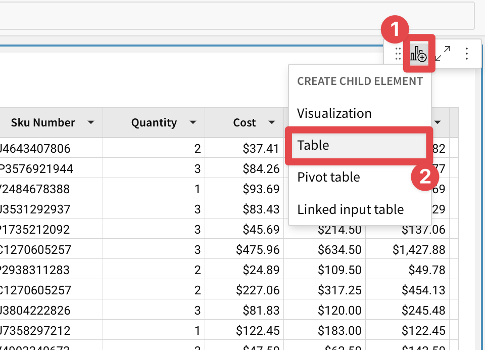

4. We will create one more table as a child element of the new “Revenue Cohort Base Table” by hovering over the top right corner of the element, selecting the “Create Child Element” icon and clicking “Table”. Finally rename the new table “Revenue Cohort”.

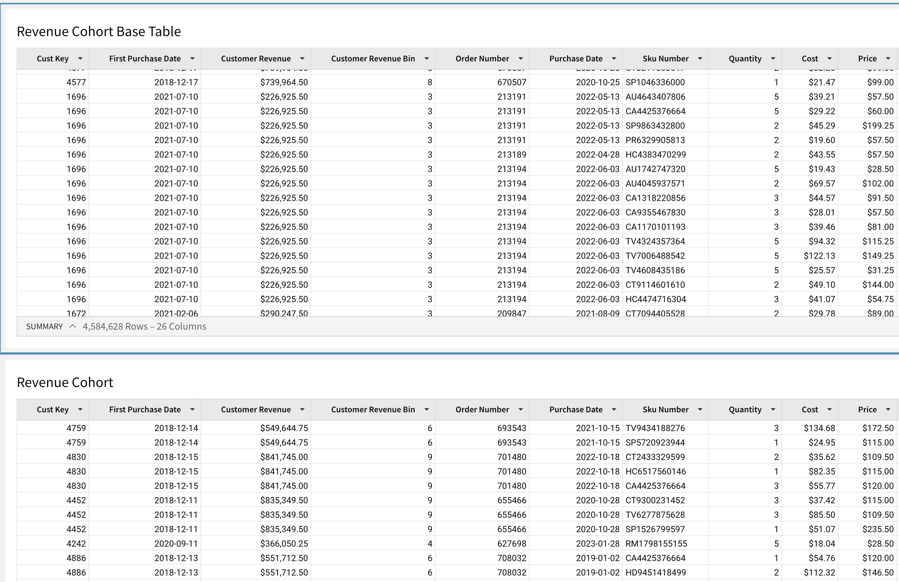

5. Now hover over the top right of the “Revenue Cohort” table, select the “Kebab” icon and click “Move to page” → “New Page”.

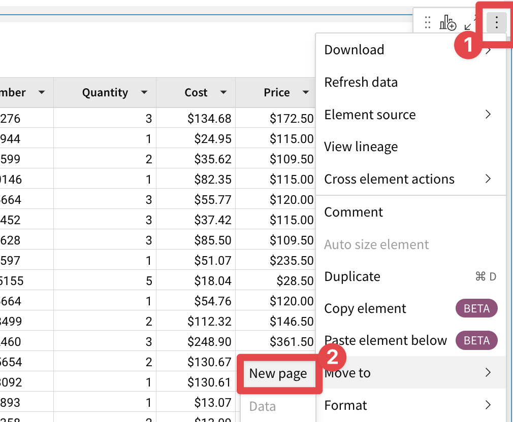

6.  Let’s rename this page to “Revenue Cohort”.

7. Now click on the arrow next to “Store Region” and select “Group Column”.

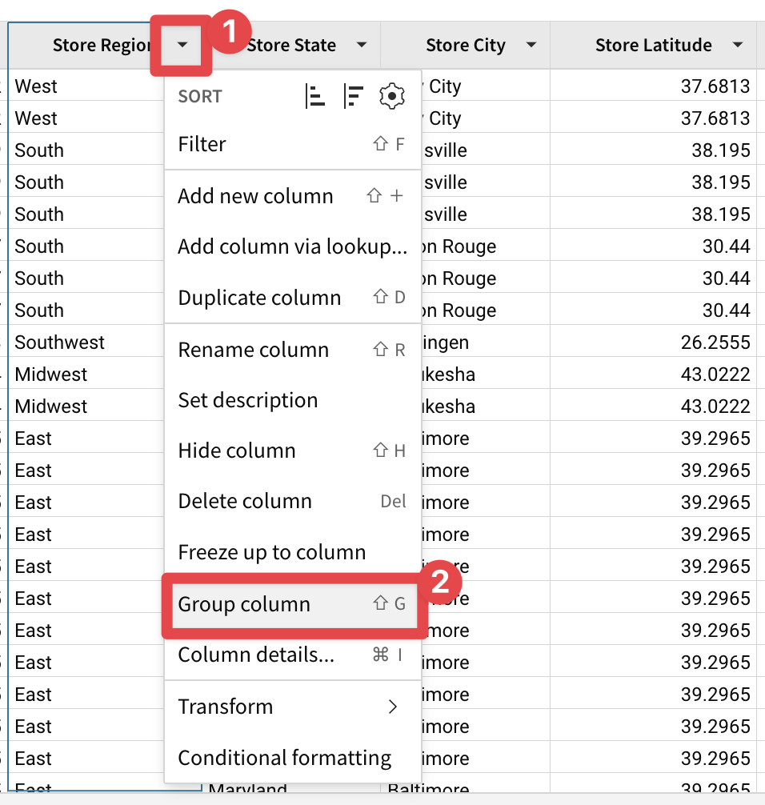

8. Next add a column with the formula “sum(revenue)” named “Region Revenue”.

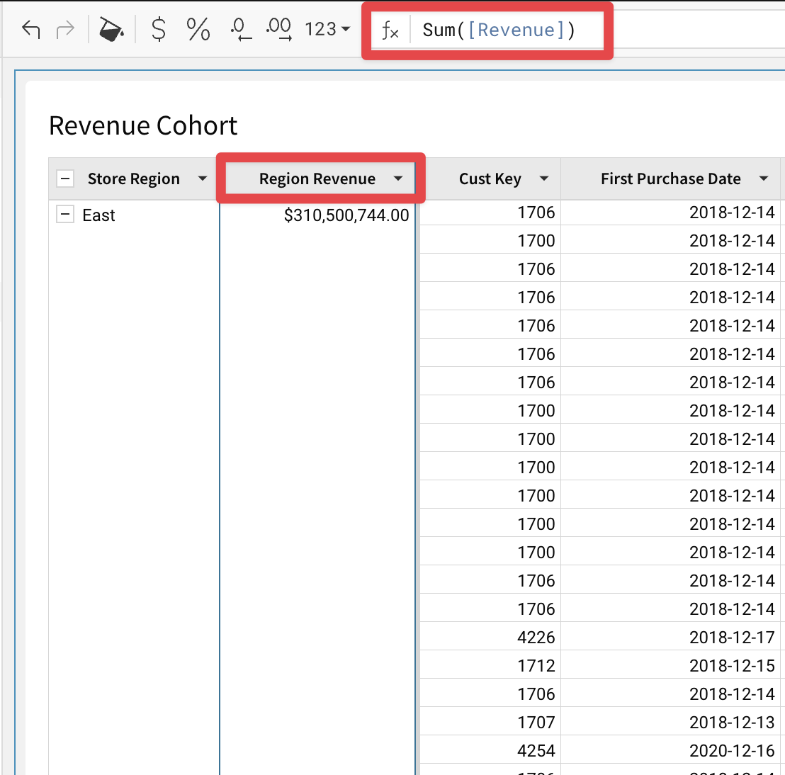

9. Click on the arrow next to “Customer Revenue Bin” and select “Group Column”.

10. Now add a column named “Bin Revenue” with the formula “sum(revenue)”.

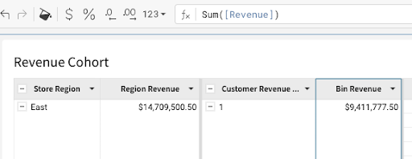

11. Next add another column named “Bin Rank” with the formula “Rank([Bin Revenue], "desc")”.

12. Finally add one more column named “% of Region” with the formula “[Bin Revenue] / [Region Revenue]” and format it as a percentage by clicking the arrow next to the column name and selecting Format - Percentage.

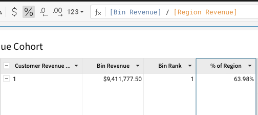

13. Now let’s collapse the “Customer Revenue Bin” grouping.

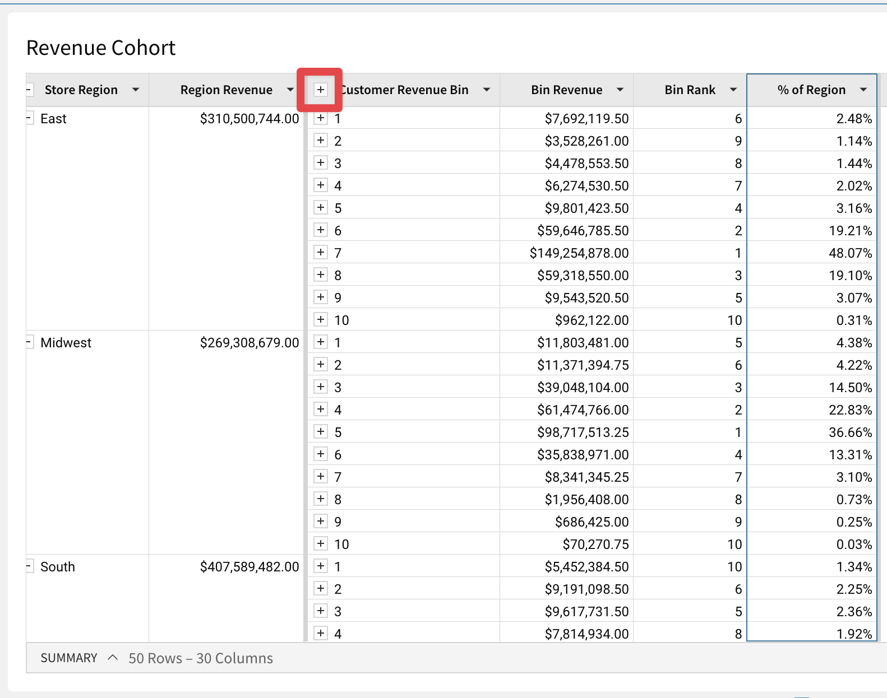

14. Let's add data bars to the “% of Region” column by right clicking it and selecting “Conditional formatting”. This will pop out the formatting pane on the left side of the screen, select the “DATA BARS” tab strip to apply them to the column.

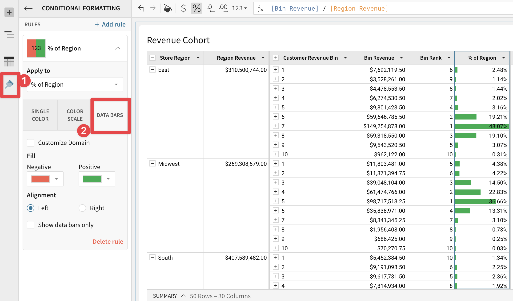

## Visualizing the Data

1.  Back on the “Data” page hover over the top right of the “Revenue Cohort Base Table” element, select the “Create Child Element” icon and click “Visualization”. Then rename the new visualization “Revenue by Store Region and Customer Bin”.

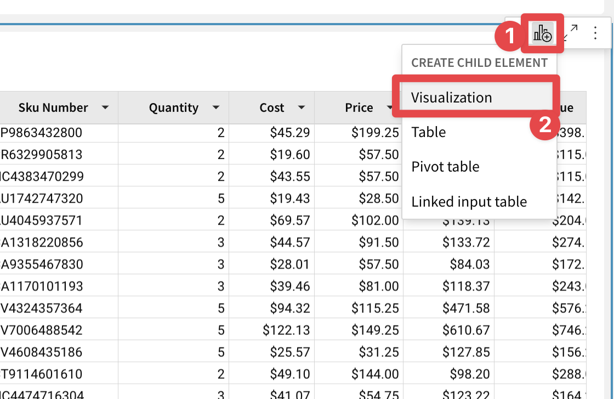

2. Now hover over the top right of the newly created visualization, select the “Kebab” icon and click “Move to page” → “Revenue Cohort”.

3. Drag and drop the following columns to the respective sections:
- “Store Region” → “X-axis”
- “Revenue” → “Y-axis”
- “Customer Revenue Bin” → “Color”

4. Now let's rearrange the layout of the workbook and drag the bar chart to the right of the “Revenue Cohort” table.

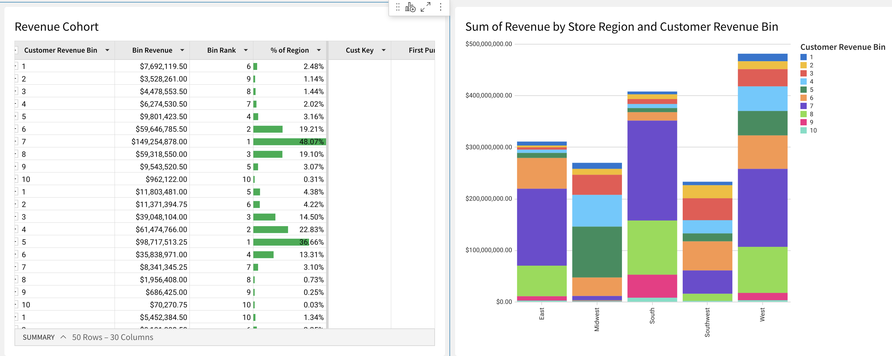

5. Finally lets modify the bar chart to be horizontally oriented by clicking it then selecting the “Display horizontal” icon on the top left pane.

## Building a Pivot Table

1. Back on the “Data” page hover over the top right of the “Revenue Cohort Base Table” element, select the “Create Child Element” icon, click “Pivot Table” and name it “Regional Sales by Revenue Bin”.

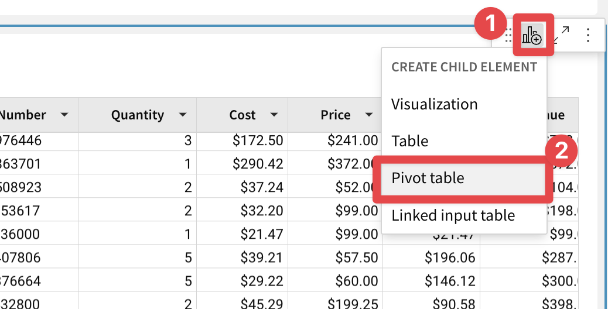

2. Now hover over the top right of the newly created visualization, select the “Kebab” icon and click “Move to page” → “Revenue Cohort”.

3. Drag and drop the following columns to the respective sections:
- “Store Region” → “Pivot Rows”
- “Customer Revenue Bin” → “Pivot Columns”
- “Revenue” → “Values”
- “Profit” → “Values”

4. Create a column by clicking the “+” icon next to values and select “New Column”, with a formula “Sum([Profit]) / Sum([Revenue])”, named “Gross Margin %”, and format it as a percentage.

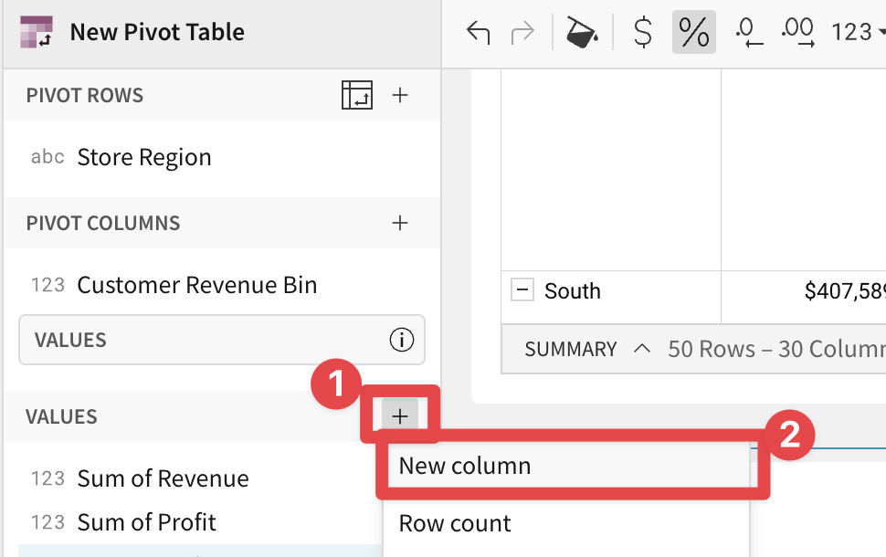

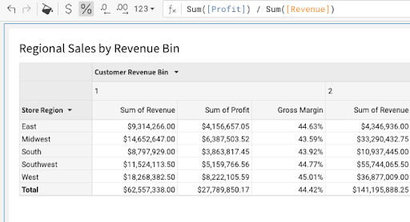

5. Now let's add conditional formatting to the “Gross Margin” column. On the left side select the paint brush and click “Conditional formatting”. Change the style to “Color Scale”.

6. Repeat the previous step for “Sum of Revenue” except this time first click “+Add rule” then select “Data Bars”.

7. Next let's drag the “Store Name” column to the “Pivot Rows” section to build out the hierarchy.

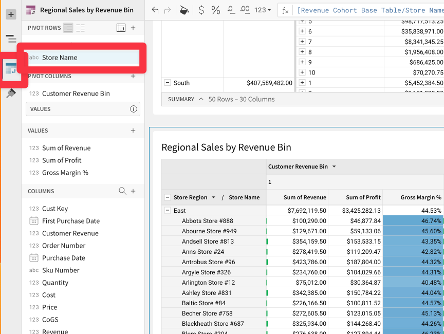

8. Now that we have built out a summarizing pivot table we might want to be able to see the underlying data. With Sigma this can be done by right clicking any cell and selecting “Show underlying data”.

## Finalizing the Workbook

1. Lets organize and spruce up the workbook to make it a finished product. Exit the underlying data view by clicking the “Minimize element” icon in the top right.

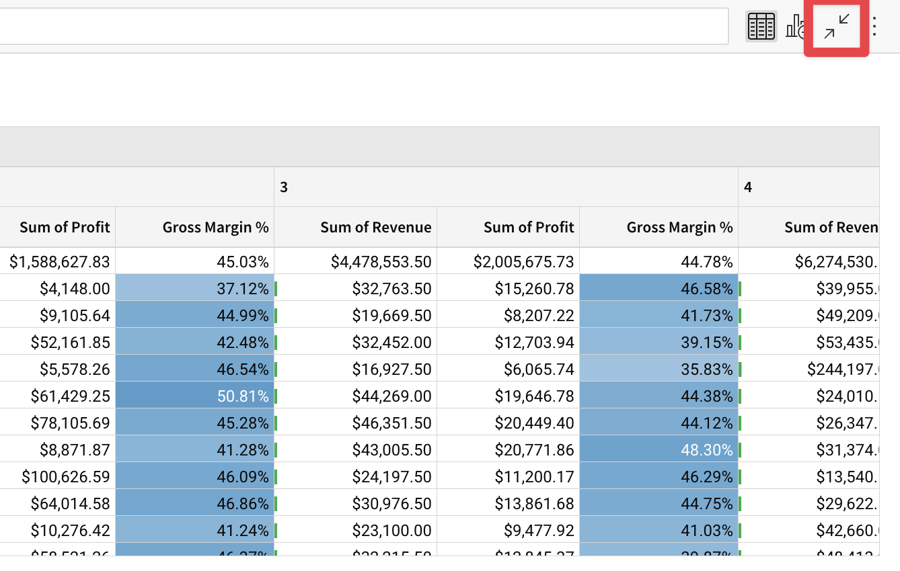

2. Let’s go back to the “Revenue Cohort Base Table” on the data page and create a filter by right clicking “Product Type”, selecting “Filter”.

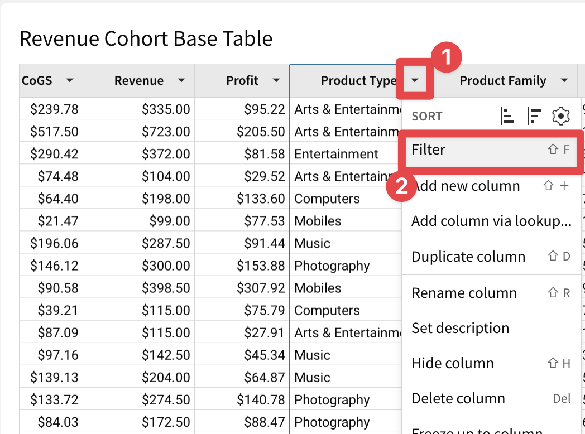

3. On the newly created filter click the “Kebab” and select “Convert to page control”.

4. Move the new “Product Type” filter to the “Revenue Cohort” Page by clicking on the “Kebab” and selecting “Move to Page” and clicking “Revenue Cohort”.

5. Now that the filter is on the “Revenue Cohort” page drag it to the top of the workbook.

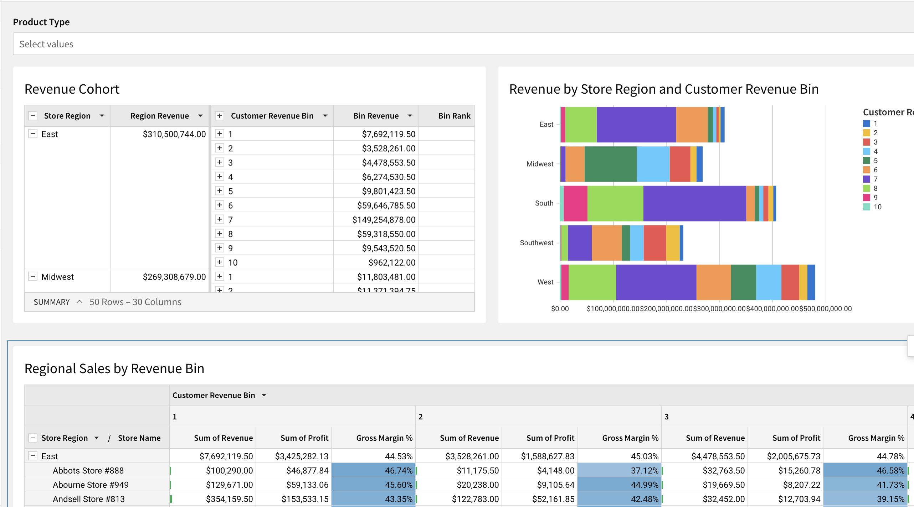

6. Repeat the previous four steps to create filter for “Product Family” and “Product Name”. 

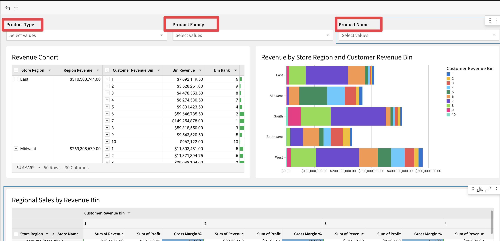

7. Finally we will create a text element, then move it to the top and name the dashboard “Product Sales Analysis”.

8. Your finished workbook should now look like this.

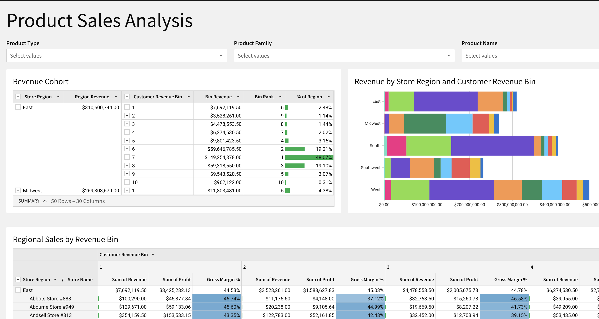

## Conclusion 

In this lab, we showcased how Sigma enables end users to do last-mile data analysis in a familiar, spreadsheet-like UI. Sigma empowers end users to create complex, cross-level metric calculations all without coding skills or writing any SQL.

### Helpful Resources

- [Help Center including Documentation](https://help.sigmacomputing.com/hc/en-us)
- [Sigma Blog](https://www.sigmacomputing.com/blog/)
- [Resources and Case Studies](https://www.sigmacomputing.com/resources/)
  